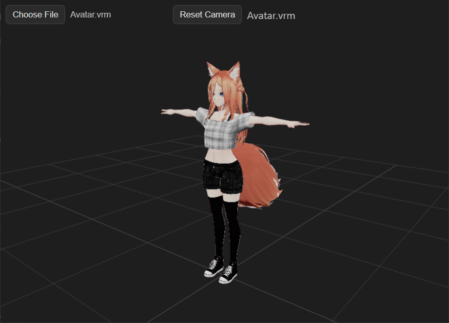

# VRM Previewer

Electron-based Windows app to quickly preview `.vrm` avatars (VRoid/VRM 0.x/1.x). After install, double-click any `.vrm` file to open it in the viewer.

## Screenshot


## Features
- Double-click `.vrm` files to preview (Windows file association)
- Drag-and-drop `.vrm` onto the window
- File picker and camera reset button
- OrbitControls, grid, tone mapping, sRGB color space
- Uses Three.js `^0.179.1` and `@pixiv/three-vrm` `^3.4.2`

## Development

Requirements: Node 18+ recommended

- Install deps:
  ```bash
  npm install
  ```
- Run in dev:
  ```bash
  npm start
  ```
  Then drag a `.vrm` file into the window or use the file picker.

## Build (Windows installer)

- Build the installer:
  ```bash
  npm run dist
  ```
- Run the generated installer at `dist/VRM Previewer Setup <version>.exe`
- After install, `.vrm` files will be associated so you can double-click to open them

## Notes
- Modules used by the renderer (`three`, OrbitControls, GLTFLoader, and `@pixiv/three-vrm`) are vendored into `src/vendor` so the packaged app can reliably load ESM modules.
- We use `VRMUtils.combineSkeletons` (with fallback) for better runtime performance.

## Tech Stack
- Electron ^31
- Three.js ^0.179.1
- @pixiv/three-vrm ^3.4.2
- electron-builder ^25
